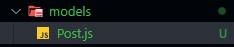
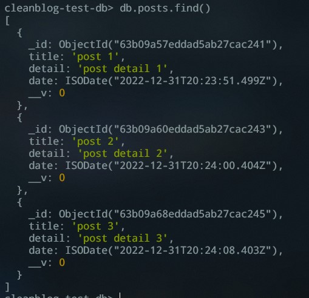
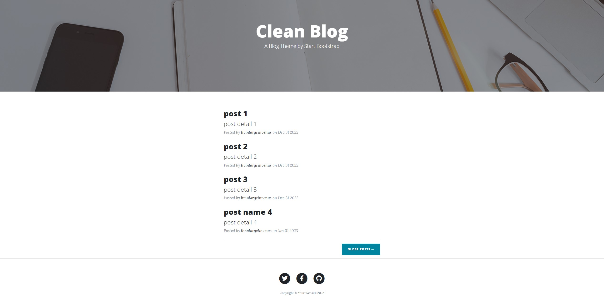

# CleanBlog

## Bölüm 1

- CleanBlog proje klasörünü oluşturalım.

```bash
mkdir CleanBlog
```

- Package.json dosyasını oluşturalım.

```bash
npm init
```

```json
"start": "nodemon app.js -L"
```

- Prettier ayarlarını yapalım.(İsteğe bağlı)

```bash
npm install prettier -D --save-exact
```

```json
{
  "tabWidth": 4,
  "useTabs": false,
  "semi": true,
  "singleQuote": true,
  "trailingComma": "es5"
}
```

- Express ve Nodemon modüllerini indirelim.

```bash
npm i express --save
npm install --save-dev nodemon
```

- git init ile lokal repomuzu oluşturalım.

```bash
git init
```

- get request içerisinde const blog = { id: 1, title: "Blog title", description: "Blog description" }, içeriğini gönderelim.

```js
const express = require('express');

const app = express();

app.get('/', (req, res) => {
    const blog = {
        id: 1,
        title: 'Blog title',
        description: 'Blog description',
    };

    res.send(blog);
});

const PORT = 3000;
app.listen(PORT, () => {
    console.log(`Sunucu ${PORT} portunda baslatildi...`);
});
```

- .gitignore dosyası oluşturalım ve ilk repomuzu gönderelim.
<https://www.toptal.com/developers/gitignore/api/node>

---

## Bölüm 2

- Public klasörü oluşturup statik dosyalarımızı içerisine yerleştirelim.

<p align="center"></p>

- İlgili middleware fonksiyonunu yazarak public klasörümüzü uygulamamıza kaydedelim.

```js
const path = require('path');

// MIDDLEWARES
app.use(express.static('public'));

// ROUTES
app.get('/', (req, res) => {
    res.sendFile(path.resolve(__dirname, './views/index.html'));
});
```

- EJS modülünü indirelim.

```bash
npm i ejs
```

```json
"ejs": "^3.1.8"
```

- Uygulamamızda EJS modülünü kullanacağımızı belirtelim.

```js
const ejs = require('ejs');

// TEMPLATE ENGINE
app.set('view engine', 'ejs');
```

- Views klasörü oluşturalım ve tüm .html dosyalarımız views klasörü içerisinde .ejs dosyalarına çevirelim.

<p align="center"></p>

- Partials klasör yapısını oluşturalım.

<p align="center"></p>

- İlgili yönlendirmeleri ve _navigation.ejs klasöründeki link düzenlemelerini yapalım.

<p align="center"></p>

```js
<%- include('./partials/_header.ejs') -%>
<%- include('./partials/_navigation.ejs') -%>
<%- include('./partials/_footer.ejs') -%>
```

<p align="center"></p>

```html
<!-- ... -->
<a class="navbar-brand" href="/">Clean Blog</a>
<!-- ... -->
<ul class="navbar-nav ml-auto">
    <li class="nav-item">
        <a class="nav-link" href="/">Home</a>
    </li>
    <li class="nav-item">
        <a class="nav-link" href="about">About</a>
    </li>
    <li class="nav-item">
        <a class="nav-link" href="add_post">Add New Post</a>
    </li>
</ul>
```

```js
// ROUTES
app.get('/', (req, res) => {
    res.render('index'); 
});

app.get('/about', (req, res) => {
    res.render('about');
});

app.get('/add_post', (req, res) => {
    res.render('add_post');
});

app.get('/post', (req, res) => {
    res.render('post');
});
```

---

## Bölüm 3

- cleanblog-test-db adında bir veri tabanı için mongoose ile gerekli bağlantı bilgilerini yazalım.

```bash
npm i mongoose
```

```js
/// App.js
// ...
const mongoose = require('mongoose');
// ...
// connect db
mongoose.set('strictQuery', false);
mongoose.connect('mongodb://127.0.0.1:27017/cleanblog-test-db', {
    useNewUrlParser: true,
    useUnifiedTopology: true,
});
```

- "Add New Post" sayfamızdan göndericeğimiz veriler req.body ile yakalayalım, gerekli middleware fonksiyonarını kullanalım.

```js
// MIDDLEWARES
app.use(express.urlencoded({ extended: true }));
app.use(express.json());
```

```js
app.post('/addpost', async (req, res) => {
    console.log(req.body);
    res.redirect('/');
});
```

```html
<!-- add_post.ejs -->
<!-- ... -->
<form method="POST" action="addpost" novalidate>
<!-- ... -->
<input type="text" name="title" class="form-control" placeholder="Name" id="name" required>
<!-- ... -->
<textarea rows="5" name="detail" class="form-control" placeholder="Message" id="message" required
<!-- ... -->
```

- title:String, detail:String, dateCreated:Date(default now) özelliklerine sahip Post modelini oluşturalım.

<p align="center"></p>

```js
/// Post.js
const mongoose = require('mongoose');
const Schema = mongoose.Schema;
// create schema
const PostSchema = new Schema({
    title: String,
    detail: String,
    date: { type: Date, default: Date.now },
});

// model
const Post = mongoose.model('Post', PostSchema);

module.exports = Post;
```

- Veri tabanımızda 3 adet pos dökümanı oluşturalım.

```js
/// App.js
// ...
const Post = require('./models/Post');
// ...
app.post('/addpost', async (req, res) => {
    await Post.create(req.body);
    res.redirect('/');
});
// ...
```

<p align="center"></p>

- Oluşturduğumuz post dökümanlarını Blog sitemizin anasayfasında gösterelim.

```js
/// App.js
// ...
// ROUTES
app.get('/', async (req, res) => {
    const addpost = await Post.find({});
    res.render('index', {
        addpost,
    });
});
// ...
```

```js
/// index.ejs
// ...
<div class="post-preview">

<% addpost.forEach( element=> { %>

    <a href="./post">
    <h2 class="post-title">
        <%= element.title %>
    </h2>
    <h3 class="post-subtitle">
        <%= element.detail %>
    </h3>
    </a>
    <p class="post-meta">Posted by
    <a href="https://github.com/livinlargeinvenus">livinlargeinvenus</a>
    on <%= element.date.toString().split(" ").slice(1, 4).join(" ") %>
    </p>

<% }) %>

</div>
// ...
```

<p align="center"></p>

---

## Bölüm 4

- index.ejs içerisinde **/posts/<%= posts[i]._id %> ile _id** bilgisini gönderelim.

```js
// index.ejs
// ...
<a href="/post/<%= element._id %>">
// ...
```

- app.js içerisinde GET metoduyla "/posts/:id" ile gönderilen "_id" yi yakalayalım.

```js
// app.js
// ...
app.get('/post/:id', async (req, res) => {
    console.log(req.params.id);
});
// ...
```

- tekil post bilgilerini post.ejs dosyasına gönderelim.

```js
// app.js
// ...
app.get('/post/:id', async (req, res) => {
    const post = await Post.findById(req.params.id);
    res.render('post', {
        post,
    });
});
// ...
```

- post.ejs içerisine post.title, post.detail ve post.dateCreated bilgilerini gönderelim. (her bir post için ayrı image kullanmayacağız)

```js
// post.ejs
// ...
<div class="post-heading">
    <h1><%= post.title %></h1>
    <h2 class="subheading"><%= post.subtitle %></h2>
    <span class="meta">Posted by
        <a href="/"><%= post.author %></a>
        on <%= post.date.toString().split(" ").slice(1, 4).join(" ") %>
    </span>
</div>
// ...
<!-- Post Content -->
<article>
<div class="container">
    <div class="row">
    <div class="col-lg-8 col-md-10 mx-auto">
        <%= post.detail %>
    </div>
    </div>
</div>
</article>
// ...
```

---
