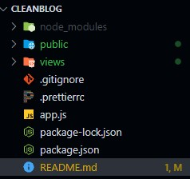
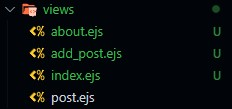
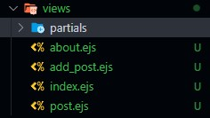
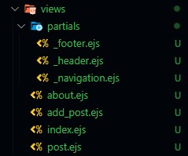
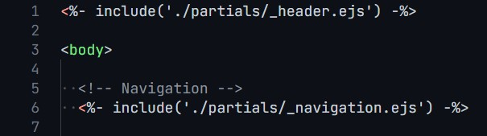

# CleanBlog

- CleanBlog proje klasörünü oluşturalım.

```bash
mkdir CleanBlog
```

- Package.json dosyasını oluşturalım.

```bash
npm init
```

```json
"start": "nodemon app.js -L"
```

- Prettier ayarlarını yapalım.(İsteğe bağlı)

```bash
npm install prettier -D --save-exact
```

```json
{
  "tabWidth": 4,
  "useTabs": false,
  "semi": true,
  "singleQuote": true,
  "trailingComma": "es5"
}
```

- Express ve Nodemon modüllerini indirelim.

```bash
npm i express --save
npm install --save-dev nodemon
```

- git init ile lokal repomuzu oluşturalım.

```bash
git init
```

- get request içerisinde const blog = { id: 1, title: "Blog title", description: "Blog description" }, içeriğini gönderelim.

```js
const express = require('express');

const app = express();

app.get('/', (req, res) => {
    const blog = {
        id: 1,
        title: 'Blog title',
        description: 'Blog description',
    };

    res.send(blog);
});

const PORT = 3000;
app.listen(PORT, () => {
    console.log(`Sunucu ${PORT} portunda baslatildi...`);
});
```

- .gitignore dosyası oluşturalım ve ilk repomuzu gönderelim.
<https://www.toptal.com/developers/gitignore/api/node>

---

- Public klasörü oluşturup statik dosyalarımızı içerisine yerleştirelim.

<p align="center"></p>

- İlgili middleware fonksiyonunu yazarak public klasörümüzü uygulamamıza kaydedelim.

```js
const path = require('path');

// MIDDLEWARES
app.use(express.static('public'));

// ROUTES
app.get('/', (req, res) => {
    res.sendFile(path.resolve(__dirname, './views/index.html'));
});
```

- EJS modülünü indirelim.

```bash
npm i ejs
```

```json
"ejs": "^3.1.8"
```

- Uygulamamızda EJS modülünü kullanacağımızı belirtelim.

```js
const ejs = require('ejs');

// TEMPLATE ENGINE
app.set('view engine', 'ejs');
```

- Views klasörü oluşturalım ve tüm .html dosyalarımız views klasörü içerisinde .ejs dosyalarına çevirelim.

<p align="center"></p>

- Partials klasör yapısını oluşturalım.

<p align="center"></p>

- İlgili yönlendirmeleri ve _navigation.ejs klasöründeki link düzenlemelerini yapalım.

<p align="center"></p>

```js
<%- include('./partials/_header.ejs') -%>
<%- include('./partials/_navigation.ejs') -%>
<%- include('./partials/_footer.ejs') -%>
```

<p align="center"></p>

```html
<!-- ... -->
<a class="navbar-brand" href="/">Clean Blog</a>
<!-- ... -->
<ul class="navbar-nav ml-auto">
    <li class="nav-item">
        <a class="nav-link" href="/">Home</a>
    </li>
    <li class="nav-item">
        <a class="nav-link" href="about">About</a>
    </li>
    <li class="nav-item">
        <a class="nav-link" href="add_post">Add New Post</a>
    </li>
</ul>
```

```js
// ROUTES
app.get('/', (req, res) => {
    res.render('index'); 
});

app.get('/about', (req, res) => {
    res.render('about');
});

app.get('/add_post', (req, res) => {
    res.render('add_post');
});

app.get('/post', (req, res) => {
    res.render('post');
});
```

---
